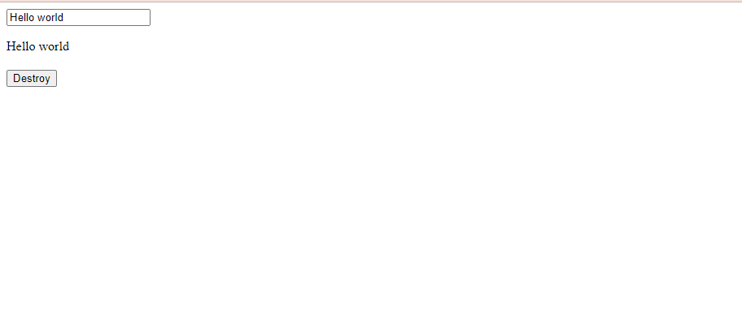
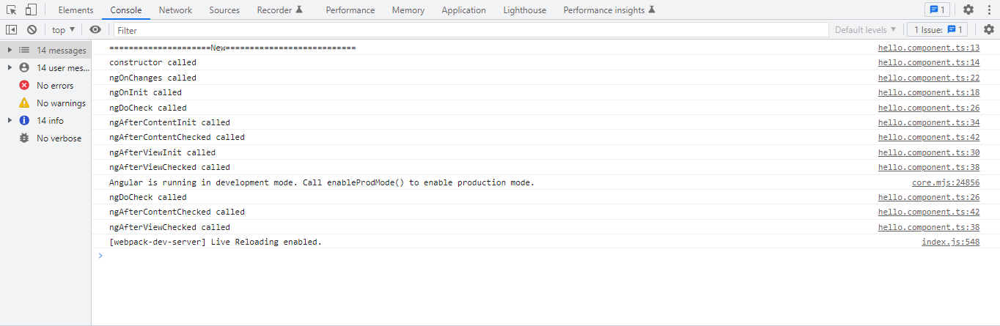

# LIFECYBLE HOOKS IN ANGULAR

Trong Angularm, một component hoặc directive có một vòng đời (lifecycle) riêng, và nó sẽ trải qua nhiều giai đoạn khác nhau khi được tạo ra, cập nhật và hủy bỏ.

Vòng đời của một component hoạc directive trong Angular được gọi là "Lifecycle Hooks". Các Lifecycle Hooks này là các phương thức được định nghĩa trong class của component hoặc directive và được gọi đến tại các thời điểm khác nhau trong vòng đời của component/directive

## NgOnInit():
Phương thức được gọi sau thi tát các thuộc tính được khởi tạo và component/directive được kết nối đến view.

## ngOnChanges():
- Phương thức này được gọi mỗi khi có sự thay đổi đầu vào (input) của component. Nó cung cấp một đối tượng SimpleChanges chứa các thông tin về các thuộc tính bị thay đổi.
- Ví dụ: Khi một component hiển thị dữ liệu từ một nguồn dữ liệu khác, ngOnChanges() được sử dụng lại để cập nhật các giá trị của component khi nguồn dữ liệu thay đổi.

## ngDoCheck():
- Phương thức này được gọi mỗi khi Angular kiểm tra sự thay đổi của component và cập nhât view. Nó cho phép bạn kiểm tra và thực hiện bất kỳ hành động nào cần thiết để bảo đảm tính nhất quán của dữ liệu.
- Ví dụ: Khi một component được sử dụng để hiển thị danh sách sản phẩm và người dùng có thể thêm/xóa sản phẩm, ngDoCheck() có thể được sử dụng để đảm bảo rằng danh sách sản phẩm hiển thị đúng và được cập nhật đúng cách.

## ngAfterViewInit():
- Phương thức này được gọi sau khi view của component được tạo hoàn thành.
- Ví dụ : Khi một component được sử dụng để hiển thị các biểu đồ dữ liệu, ngAfterViewInit() có thể được sử dụng để đảm bảo rẳng biểu đồ được vẽ đúng và hiển thị đúng cách.

## ngAfterContentInit():
- Phương thức này được gọi sau khi content projection của component đã được tạo hoàn thành.

- Ví dụ: Khi một component chứa các tab và nội dung của tab được đưa vào bằng projection, ngAfterContentInit() có thể được sử dụng để đảm bảo rằng nội dung của tab được hiển thị đúng và được cập nhật đúng cách.

## ngAfterViewChecked():
- Phương thức này được gọi sau khi Angular đã kiểm view của component và cập nhật nó nếu cần thiết.
- Ví dụ: Khi một component được sử dụng để hiển thị dữ liệu từ một nguồn dữ liểu khác, ngAfterViewChecked() có thể được sử dụng để đảm bảo rằng dữ liệu hiển thị đúng và được cập nhật đúng cách.

## ngAfterContentChecked():
- Phương thức này được gọi sau khi Angular đã kiểm tra content projection của component và cập nhật nó nếu cần thiết
- Ví dụ: Khi một component chứa các tab và nội dung của tab được đưa vào bằng projection, ngAfterContentChecked() có thể được sử dụng để đảm bảo rằng nội dung của tab được hiển thị.

## ngOnDestroy():
- Phương thức này được gọi trước khi component/directive bị hủy và gỡ bỏ khỏi view.

## EXAMPLE:
Phần này chỉ quan tâm đến các Lifecycle Hooks, các khái niệm liên quan sẽ được giải thích trong phần sau.

Khởi tạo HelloComponent bằng câu lệnh:
```bash
ng g c hello --skip-tests
```
Hoặc để tường minh hơn của thể sử dụng câu:
```bash
ng generate component hello --skip-tests
```

### HelloComponent
- hello.component.html
```html
<p>{{inputValue}}</p>
```
- hello.component.ts
```typescript
import { Component, OnInit, OnChanges, DoCheck, AfterViewInit, AfterContentInit, AfterViewChecked, AfterContentChecked, OnDestroy, Input } from '@angular/core';

@Component({
  selector: 'app-hello',
  templateUrl: './hello.component.html',
  styleUrls: ['./hello.component.scss']
})
export class HelloComponent implements OnInit, OnChanges, DoCheck, AfterViewInit, AfterContentInit, AfterViewChecked, AfterContentChecked, OnDestroy {

  @Input() inputValue: string | undefined;

  constructor() {
    console.log("=====================New===========================")
    console.log('constructor called');
  }

  ngOnInit() {
    console.log('ngOnInit called');
  }

  ngOnChanges() {
    console.log('ngOnChanges called');
  }

  ngDoCheck() {
    console.log('ngDoCheck called');
  }

  ngAfterViewInit() {
    console.log('ngAfterViewInit called');
  }

  ngAfterContentInit() {
    console.log('ngAfterContentInit called');
  }

  ngAfterViewChecked() {
    console.log('ngAfterViewChecked called');
  }

  ngAfterContentChecked() {
    console.log('ngAfterContentChecked called');
  }

  ngOnDestroy() {
    console.log('ngOnDestroy called');
  }

}
```
### AppComponent
- app.component.html
```html
<div>
  <input type="text" [value]="value" [(ngModel)]="value">
</div>
<div>
  <app-hello *ngIf="isShow" [inputValue]="value"></app-hello>
</div>
<div style="margin-top: 20px;">
  <button type="button" (click)="destroy()">Destroy</button>
</div>
```
- app.component.ts
```typescript
import { Component } from '@angular/core';

@Component({
  selector: 'app-root',
  templateUrl: './app.component.html',
  styleUrls: ['./app.component.scss']
})
export class AppComponent {

  value: string = "Hello world";
  isShow: boolean = true;

  destroy() {
    this.isShow = !this.isShow;
  }
}
```
### SCREEN
- View:


- Lifecycle:


- Như trong ví dụ có thể thấy: Các lifecycle hooks được gọi khi component/view được khởi tạo xong lần lượt là :
    + `constructor`
    + `ngOnChanges`
    + `ngOnInit`
    + `ngDoCheck`
    + `ngAfterContentInit`
    + `ngAfterContentChecked`
    + `ngAfterViewInit`
    + `ngAfterViewChecked`

- TRONG VÍ DỤ CODE Ở PHÍA TRÊN : Khi ta thay đổi giá trị của trong input, Angular sẽ property binding dữ liệu với biến value và thay đổi dữ liệu @Input inputvalue của HelloComponent. Lúc này HelloComponent nhận thấy giá trị nguồn của mình đang bị thay đổi nên các lifecycle hook được gọi đến là :
    + `ngOnChanges`
    + `ngDoCheck `
    + `ngAfterContentChecked `
    + `ngAfterViewChecked`
- Done, giờ ta sẽ kiểm tra thêm 1 chút. Thêm 1 button có sự kiện check() ở hello.component.html. Định nghĩa sự kiện check() ở hello.component.ts

```html
<div>
  <button type="button" (click)="check()">Button</button>
</div>
```
```typescript
  check() {

  }
```
Sự kiện check() là 1 function rỗng sẽ không làm thay đổi view và component. Vậy nó có call đến bất lifecycle hooks nào không?
Đáp án là có : `ngDoCheck`, `ngAfterContentChecked`, `ngAfterViewChecked` sẽ là 3 lifecycle hook được gọi.

Nguyên nhân là vì `ngDoCheck`, `ngAfterContentChecked`, `ngAfterViewChecked` là một Lifecycle Hook được gọi trong vòng đời của Angular và nó được gọi bất cứ khi nào Angular kiểm tra sự thay đổi của component và cập nhật view.

Các lý do khiến Angular kiểm tra và cập nhật view có thể là:

- Có sự thay đổi trong thuộc tính đầu vào (@Input) của component.
- Có sự kiện xảy ra trong component, chẳng hạn như click hoặc hover, và dẫn đến sự thay đổi trong view.
- Có thay đổi trong dữ liệu được lưu trữ trong component hoặc dữ liệu được lấy từ server.

Vì vậy, nếu có bất kỳ sự kiện nào xảy ra trong component, `ngDoCheck` sẽ được gọi lại để kiểm tra và cập nhật view. Tuy nhiên, nếu không có bất kỳ thay đổi nào xảy ra trong component, `ngDoCheck` sẽ không được gọi lại.

- Sự kiện destroy() sẽ gọi đến lifecycle hook : `ngOnDestroy()` vì HelloComponent bị delete khỏi DOM.

## SUMMARY:
