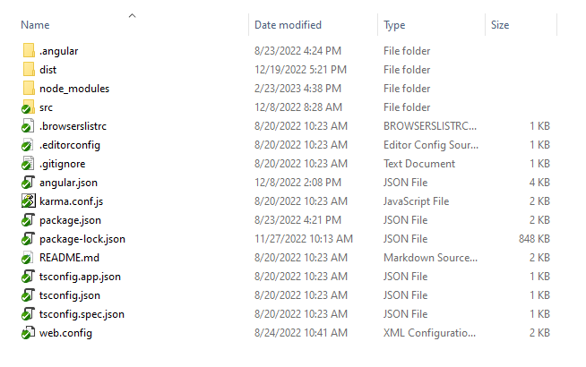
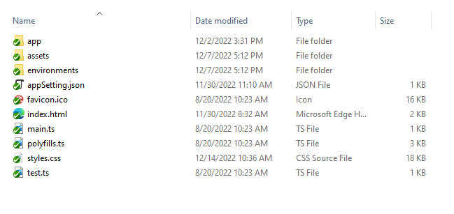
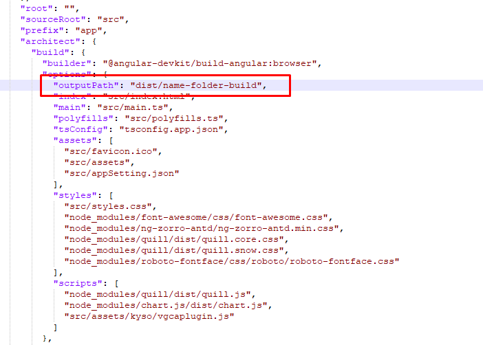

# INTRODUCE ANGULAR APP



## SRC


- index.html: bên trong tag body sẽ có một tag HTML khá khác lạ (app-root trong hầu hết trường hợp). Tag này không hề tồn tại trong HTML, ắt hẳn là một custom tag/selector của application, hay nói cách khác đây là là cái gì bảo ngoài của một view nào đó trong ứng dụng

- main.ts: đây là nơi khởi đầu của application, bên trong đoạn code TypeScript (TS) thông thường, nó là một module (ES module/ TS module), nó đã import một số thứ khác từ một số thư viện/module khác để sử dụng. Không có gì đặc biệt trong file này, nó chỉ gọi đến một hàm nào đó để thực thì bootstrap application.

- app/app.module.ts : Đây là một NgModule. Hiểu đơn giản TS module là cách mà chúng ta tổ chức code thành các phần nhỏ có thể là các file, các folder, mỗi một file TS sẽ đóng gói thành một module, có thể import module khác hoặc export một số thành phần code trong nó cho Module khác sử dung. Còn NgModule là cách mà chúng ta tổ chức phần chức năng của một Angular application. Mỗi Angular app sẽ được chia thành nhiều NgModule. Trong đó AppModule là root NgModule (duy nhất).

- AppComponent: đây là root component của ứng dung => tag app-root trong index.html là chỉ index.html

## NODE_MODULES

Đây là nơi chứa tất cả các thư viện mà project sử dụng. Có thể kiểm tra các thư viện được import trong hệ thống từ file package.json

```bash
npm install --save
```

## DIST
Đây là nơi chưa các folder project sau khi build (default)

```bash
ng build 
```

- Lưu ý :
    Có thể chỉnh sửa đường dẫn khi build trong angular.json



## KHỞI TẠO THÊM MỘT COMPONENT MỚI

Một Angular application sẽ được tạo từ nhiều component, nên không để hết code vào AppComponent. Tạo mới file hello.components.ts cùng trong thư mục của app.component.ts và thực hiện coding

- Open Command Prompt tại thư mục bạn muốn khởi tạo Component. Chạy câu lệnh :

```
ng generate component hello --skip-tests
```

- Result: Angular CLI sẽ tự động generate ra thư mục hello chưa 3 file:
    + hello.component.css (scss,.. tùy thuộc vào style bạn chọn khi khởi tạo project)
    + hello.component.html
    + hello.component.ts

- Xong một component. Với selector: `<app-hello></app-hello>` chúng ta có thể sử dụng như 1 thẻ tag thông thường. Có thẻ mở app.component.html và chèn thêm selector của HellpComponent vừa tạo xem

```html
<app-hello></app-hello>
```

Save file và khởi chạy ứng dụng vs lện `ng serve`. Ta da: thưởng thức thành quả

* Lưu ý: 

1. Khi khởi tạo bằng câu lệnh `ng generate component hello --skip-tests`. Hệ thống sẽ tự động import component vào declarables của Module chứa component

2. Nếu khởi tạo bằng tay và không import component sẽ gặp lỗi :
    - error NG8001: 'app-hello' is not a known element:
        + If app-hello is an Angular component, then verify that it is part of this module.
        + If app-hello is a Web Component then add 'CUSTOM_ELEMENTS_SCHEMA' to the '@NgModule.schemas' of this component to suppress this message.

    => 

## LINK THAM KHẢO
- https://angular.io/guide/architecture
- https://angular.io/guide/architecture-modules
- https://angular.io/guide/architecture-components


